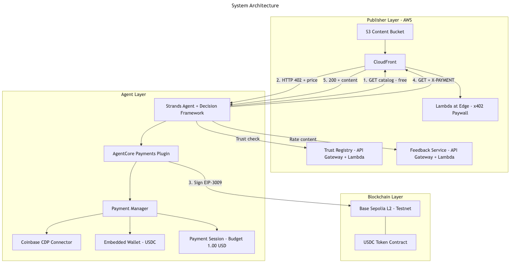

# AgentCore Payments — Media Content Monetization PoC

AI agents paying for premium media content via x402 micropayments. End-to-end proof of concept showing both the **publisher side** (merchant paywall) and the **agent side** (autonomous buyer with budget controls).

> ⚠️ **All sample content is synthetic.** Merchant names, article text, metrics, and company references in this repository are entirely fictional. Any resemblance to real organizations is coincidental. This is a technical demonstration of the x402 payment protocol, not market research.

## The Problem

Publishers face a binary choice with AI agents: **block them** or **let them scrape for free**. There's no "pay per article" button for a research agent that needs content from multiple sources in a single task.

## The Solution

This PoC demonstrates a third path: agents pay per-article via [x402 micropayments](https://docs.aws.amazon.com/bedrock-agentcore/latest/devguide/payments.html), settling in milliseconds at fractions of a cent.

## Demo

[](https://schristoph.online/media/2026-06-03-building-agent-that-pays-demo.mp4)

> 🎬 **[Click to watch the 4-min demo video](https://schristoph.online/media/2026-06-03-building-agent-that-pays-demo.mp4)** — the agent discovers content, evaluates trust scores, makes autonomous purchase decisions, and synthesizes a research brief.

## Architecture

```
┌─────────────────────────────────────────────────────────────┐
│  PUBLISHER (Merchant)                                        │
│                                                              │
│  S3 (articles) → CloudFront → Lambda@Edge (x402 paywall)   │
│                                                              │
│  • Free: catalog/index                                       │
│  • $0.003: standard articles                                 │
│  • $0.005: data feeds                                        │
│  • $0.01: premium research                                   │
└──────────────────────────┬──────────────────────────────────┘
                           │ HTTP 402 + price / X-PAYMENT header
┌──────────────────────────┴──────────────────────────────────┐
│  AGENT (Buyer)                                               │
│                                                              │
│  Strands Agent + AgentCore Payments Plugin                   │
│                                                              │
│  • Discovers content via catalog                             │
│  • Encounters 402 → plugin auto-pays via Coinbase wallet    │
│  • Reads content → synthesizes research brief               │
│  • Reports total spend                                       │
│                                                              │
│  Budget: $1.00 USDC session limit                           │
└─────────────────────────────────────────────────────────────┘
```

### Payment Flow (x402 Protocol)

```
Agent                    CloudFront/Lambda@Edge           Blockchain (Base L2)
  │                              │                              │
  │── GET /premium/article ─────►│                              │
  │◄── 402 + payment payload ────│                              │
  │                              │                              │
  │── [AgentCore checks budget] ─┤                              │
  │── [Signs payment via wallet]─┼─── USDC transfer ──────────►│
  │                              │                              │
  │── GET + X-PAYMENT header ───►│                              │
  │                              │── verify payment proof ──────►│
  │◄── 200 + article content ────│                              │
```

## Project Structure

```
agentcore-payments-media-poc/
├── merchant-stack/          # CDK — publisher infrastructure
│   ├── lib/                 # CDK stack definition
│   ├── lambda/x402-paywall/ # Lambda@Edge paywall logic
│   ├── sample-content/      # Mock media articles (3 tiers)
│   └── bin/                 # CDK app entry
├── agent/                   # Python — research agent
│   ├── research_agent.py    # Strands agent + payments plugin
│   ├── setup_payments.py    # Interactive setup helper
│   └── requirements.txt
└── docs/                    # Architecture diagrams
```

## Prerequisites

1. **AWS Account** with CDK bootstrapped in `us-east-1`
2. **Coinbase CDP Account** (free) — [portal.cdp.coinbase.com](https://portal.cdp.coinbase.com/)
3. **Node.js 18+** and **Python 3.10+**
4. **AWS CLI** configured

## Setup Guide

### Step 1: Deploy the Merchant Stack

```bash
cd merchant-stack
npm install
npx cdk bootstrap  # if not already done
npx cdk deploy
```

Note the `DistributionUrl` output — this is your merchant endpoint.

### Step 2: Get Coinbase CDP Credentials

1. Go to [portal.cdp.coinbase.com](https://portal.cdp.coinbase.com/)
2. Create a new project
3. Generate an API key (save the key ID and secret)

### Step 3: Configure AgentCore Payments

```bash
cd agent
pip install -r requirements.txt
python setup_payments.py
```

This creates:
- Payment Manager (coordinates payment operations)
- Payment Connector (links to Coinbase CDP)
- Payment Instrument (embedded wallet)
- Payment Session ($1.00 budget, 1-hour expiry)

### Step 4: Fund the Wallet (Free — Testnet)

Get free testnet USDC:
1. Go to [faucet.circle.com](https://faucet.circle.com)
2. Select **Base Sepolia** network
3. Paste your wallet address (from setup script output)
4. Receive free testnet USDC (can request multiple times, no limit)

### Step 5: Run the Agent

```bash
source .env
export MERCHANT_URL=<DistributionUrl from Step 1>

python research_agent.py
```

Or with a custom topic:

```bash
export RESEARCH_TOPIC="How are publishers monetizing AI agent traffic?"
python research_agent.py
```

## Sample Output

```
============================================================
Research Topic: What are the latest trends in AI agent traffic?
Merchant: https://d1234abcdef.cloudfront.net
============================================================

[Agent] Fetching content catalog...
[Agent] Found 6 articles. Selecting relevant ones...
[Agent] Purchasing: "Agent Traffic Report" ($0.01) ✓
[Agent] Purchasing: "Publisher Revenue Deep Dive" ($0.01) ✓
[Agent] Purchasing: "Streaming Wars Q2" ($0.003) ✓

Research Brief:
AI agent traffic now accounts for 23% of news site visits...
[synthesized findings]

Spend Report:
  - 3 articles purchased
  - Total: $0.023 USDC
  - Budget remaining: $0.977 / $1.00
============================================================
```

## Cost

| Component | Cost |
|-----------|------|
| AgentCore Payments (Preview) | Free |
| CloudFront | Free tier (1TB/month) |
| Lambda@Edge | Free tier (1M requests) |
| Bedrock model calls | ~$0.01-0.05 per research session |
| USDC (Base Sepolia testnet) | **Free** — from faucet.circle.com |
| Gas fees (Base Sepolia) | **Free** — testnet |

**Total PoC cost: $0** (only Bedrock model invocation costs apply, typically cents per session)

> **Note:** This PoC uses Base Sepolia testnet by default. Testnet USDC has zero monetary value.
> To switch to production (real money), change 3 variables — see "Going to Production" below.

## Customization

### Add Your Own Content

Drop JSON files into `merchant-stack/sample-content/` following the schema:

```json
{
  "id": "my-article",
  "title": "Article Title",
  "tier": "standard|premium|data",
  "price_usdc": 0.003,
  "content": "Full article text..."
}
```

### Adjust Pricing

Edit `merchant-stack/lambda/x402-paywall/index.js`:

```javascript
const PRICING = {
  "/articles/": 0.003,
  "/premium/": 0.01,
  "/data/": 0.005,
};
```

## Going to Production

To switch from testnet to real payments, change 3 values:

| File | Variable | Testnet | Production |
|------|----------|---------|------------|
| `lambda/x402-paywall/index.js` | `NETWORK` | `base-sepolia` | `base` |
| `lambda/x402-paywall/index.js` | `USDC_CONTRACT` | `0x036CbD53842c5426634e7929541eC2318f3dCF7e` | `0x833589fCD6eDb6E08f4c7C32D4f71b54bdA02913` |
| `agent/setup_payments.py` | `network` | `base-sepolia` | `base` |

Then fund the wallet with real USDC instead of using the faucet.

## Related Resources

- [AgentCore Payments Docs](https://docs.aws.amazon.com/bedrock-agentcore/latest/devguide/payments.html)
- [x402 Protocol Spec](https://www.x402.org/)
- [AWS Blog: x402 and Agentic Commerce](https://aws.amazon.com/blogs/industries/x402-and-agentic-commerce-redefining-autonomous-payments-in-financial-services/)
- [Blog: HTTP 402 — When Agents Pay](https://schristoph.online/blog/http-402-agents-pay/)
- [Merchant Sample (AWS)](https://github.com/aws-samples/sample-x402-content-monetization-with-cloudfront-and-waf)

## License

MIT-0
